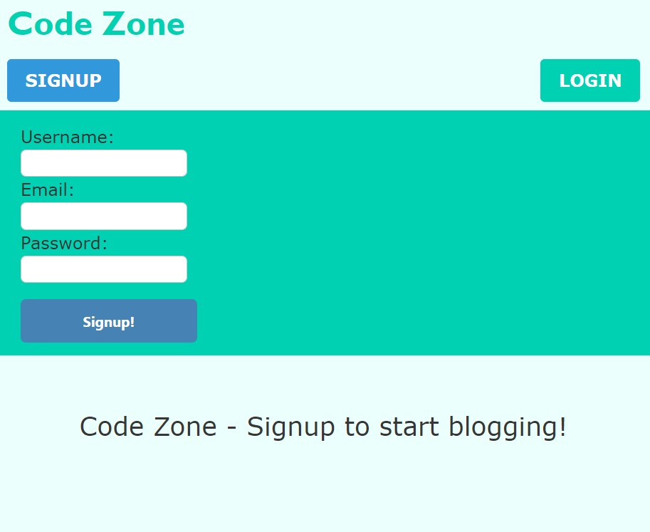
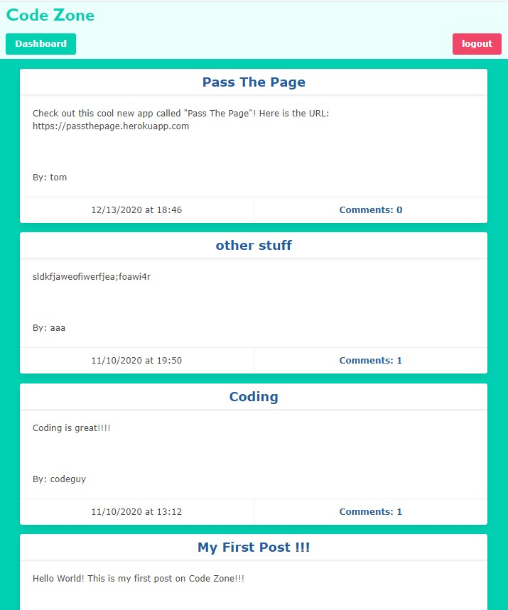
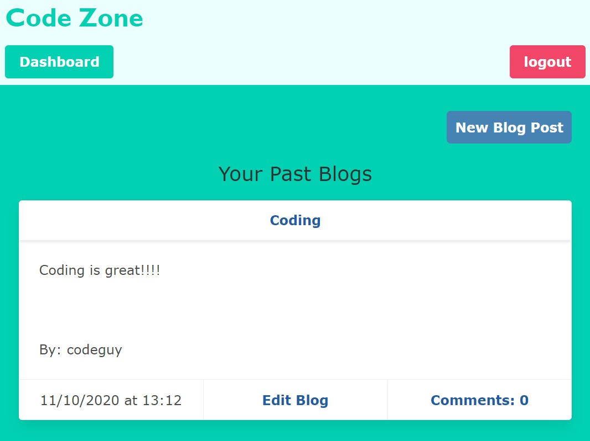

# Code Zone

     

  ## Description
  Code Zone is a developer blog app where users can signup for an account, login with their username and password, publish blog posts, comment on others' posts, and update or delete their own posts. 
  This is a RESTful API app using MySQL with Sequelize as an ORM.Express-session and bcrypt are used for user authentication.

 #### User Signup Page:
 

 #### User Dashboard with Their Blogs:

#### Main Page with All Users' Blogs:

  ## Table of Contents
  - [Installation](#installation)
  - [Tech Used](#tech-used)
  - [Questions](#questions)
  - [Links](#links)
  - [License](#license) 
  
  ## Installation
  - Both Node.js and MySQL must be installed on your computer.
  - Clone the repo by copying and pasting in your command line: 
    - `git clone git@github.com:tchestnut85/code-zone.git`
  - Navigate to the root directory and run: 
    - `npm install`
  - To start the server, run the following in your command line: 
    - `npm start`
  - Navigate to your `localhost:3001` in your browser to open the app locally.

  ## Tech Used
  - JavaScript
  - [Handlebars.js](https://handlebarsjs.com/)
  - [Node.js](https://nodejs.org/en/)
  - [Express.js](https://www.npmjs.com/package/express)
  - [Express-session](https://www.npmjs.com/package/express-session)
  - [bcrypt](https://www.npmjs.com/package/bcrypt)
  - [MySQL](https://dev.mysql.com/doc/)
  - [MySQL2](https://www.npmjs.com/package/mysql2)
  - [Sequelize](https://www.npmjs.com/package/sequelize)
  - [dotenv](https://www.npmjs.com/package/dotenv)
  - [Bulma](https://bulma.io/documentation/)
  
  ## Questions
  Please visit my **[GitHub profile](https://github.com/tchestnut85/)** to check out this and other projects I've created and contributed to.
  If you have any specific questions about this project, please contact me at <tchestnut85@gmail.com>.

  ## Links
  - **[Deployed App](https://code-zone.herokuapp.com/)**
  - **[GitHub Repo](https://github.com/tchestnut85/code-zone/)**
  - **[My Portfolio](https://tchestnut85.github.io/)**
  - **[Connect on LinkedIn](https://www.linkedin.com/in/thomas-chestnut)**

  ## License  
      
  This app is licensed under the MIT license.
